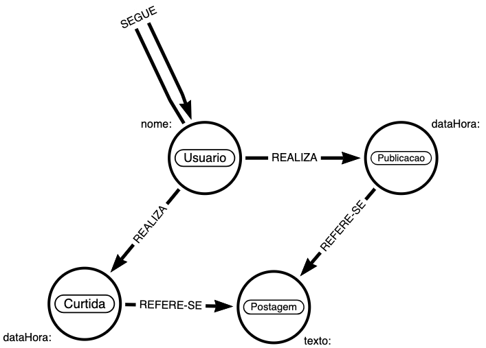

# Desafio

Uma startup de análise de mídias sociais dseja criar um novo produto ou ofereça insights sobre o engajamento e as conexões entre usuários em uma plataforma

Eles precisam de um protótipo funcional que possa responder a perguntas complexas sobre interações de usuários, popularidade de contúdo e comunidades de interesse 

Utilizando os conhecimentos adquiridos em todo o módulo, você deverá projetar, construir e consultar um banco de dados de grafos para essa rede social.

